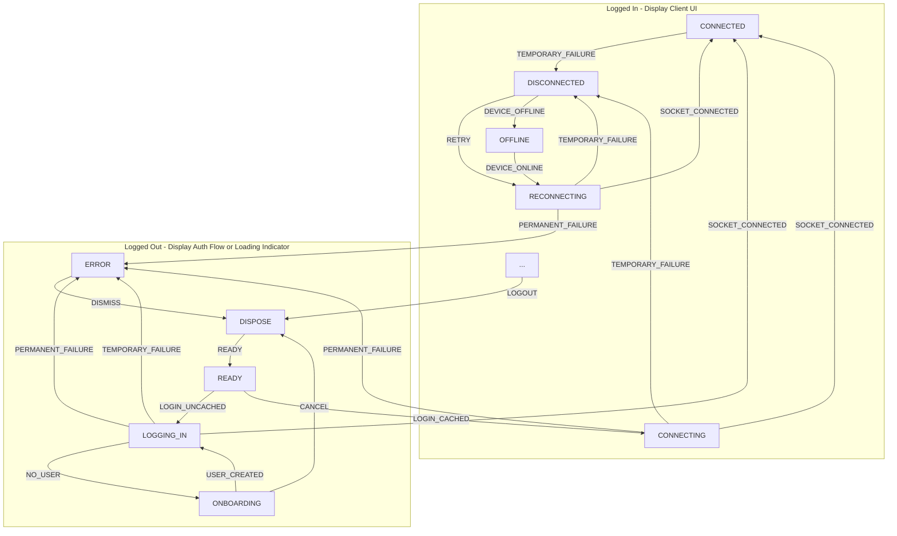

# Session Lifecycle

To ensure reliability for users on Revolt, clients should implement the following rigid specification for maintaining a session. At a high-level, it should be implemented as a state machine.

<style>
.mermaid { background: white; border-radius: 4px; }
</style>



## Implementation Details

The table below describes how each node should behave.

- All nodes SHOULD have corresponding visual feedback.
- Nodes MAY have effects on entry.
- You SHOULD keep track of additional state such as:
  - Number of connection failures

|     Node     | User Interface                                     | Logic                                                                                                                                                                                                                                      |
| :----------: | :------------------------------------------------- | :----------------------------------------------------------------------------------------------------------------------------------------------------------------------------------------------------------------------------------------- |
|    READY     | Show login interface                               | _May transition out by external source._                                                                                                                                                                                                   |
|  LOGGING_IN  | Show loading indicator                             | On entry, try to authenticate the user.                                                                                                                                                                                                    |
|  ONBOARDING  | Show username selection                            | _May transition out by external source._                                                                                                                                                                                                   |
|    ERROR     | Show the permanent error with option to dismiss it | _May transition out by external source._                                                                                                                                                                                                   |
|   DISPOSE    | Show loading indicator                             | Dispose current client and create a new one.                                                                                                                                                                                               |
|  CONNECTING  | Show client UI with banner "Connecting"            | On entry, try to connect socket.                                                                                                                                                                                                           |
|  CONNECTED   | Show client UI                                     | _May transition out by external source._ <br> Set connection failures to $ 0 $.                                                                                                                                                            |
| DISCONNECTED | Show client UI with banner "Disconnected"          | _May transition out by external source._ <br> Increment connection failures by $ 1 $. <br> <br> If the device is offline, trigger transition to OFFLINE. <br> <br> On entry, set a timer to retry<sup>†</sup>. <br> On exit, cancel timer. |
| RECONNECTING | Show client UI with banner "Reconnecting"          | On entry, invalidate cached data (message history, members list) and try to connect socket.                                                                                                                                                |
|   OFFLINE    | Show client UI with banner "Device offline"        | _May transition out by external source._                                                                                                                                                                                                   |

<sup>†</sup> Please use the formula $ (2^x-1) \pm 20 \% \textsf{ seconds} $ for the delay where $ x $ is failure count.

```js
// JavaScript implementation
let retryIn =
  (Math.pow(2, connectionFailureCount) - 1) * (0.8 + Math.random() * 0.4);
let retryInMs = retryIn * 1e3;
setTimeout(() => reconnect(), retryInMs);
```

The following listeners need to be registered that emit the given transitions:

| Listener                                      | Transition          |
| --------------------------------------------- | ------------------- |
| Connected to Revolt (and initial data loaded) | `SOCKET_CONNECTED`  |
| Connection to Revolt dropped                  | `SOCKET_DROPPED`    |
| Received logout event from socket             | `LOGOUT`            |
| Connection failed                             | `TEMPORARY_FAILURE` |
| Connection failed (session invalid)           | `PERMANENT_FAILURE` |
| Device has gone online                        | `DEVICE_ONLINE`     |

## Socket Details

When implementing your WebSocket connection, you should also implement the following:

- A heartbeat mechanism that sends the [Ping](https://developers.revolt.chat/developers/events/protocol.html#ping) event every 30 seconds, and disconnects if a [Pong](https://developers.revolt.chat/developers/events/protocol.html#pong) event is not received within 10 seconds.
- A connection timeout mechanism that drops the WebSocket connection if no message is received within 10 seconds of initiating the connection.

## User Experience Considerations

- While not strictly relevant to session lifecycle, if you encounter BlockedByShield during login, you should provide a link to the [relevant support article](https://support.revolt.chat/kb/safety/blocked-for-spam).
- Upon encountering a permanent error (session invalid), you should use the known user information to fetch their [current flags](https://developers.revolt.chat/developers/api/reference.html#tag/user-information/get/users/{target}/flags). This way the message can be tailored to display if: they have been logged out, they disabled their account, their account has been suspended, or their account has been banned.
- When a logout event is received externally, show some sort of indicator that they have been logged out beyond just kicking them to the login screen.
- ~~If the connection failure count reaches $ 3 $ or more, query the health service for any outage information.~~ This point is WIP, need considerations about increasing polling rate while connection failures are high, etc.
