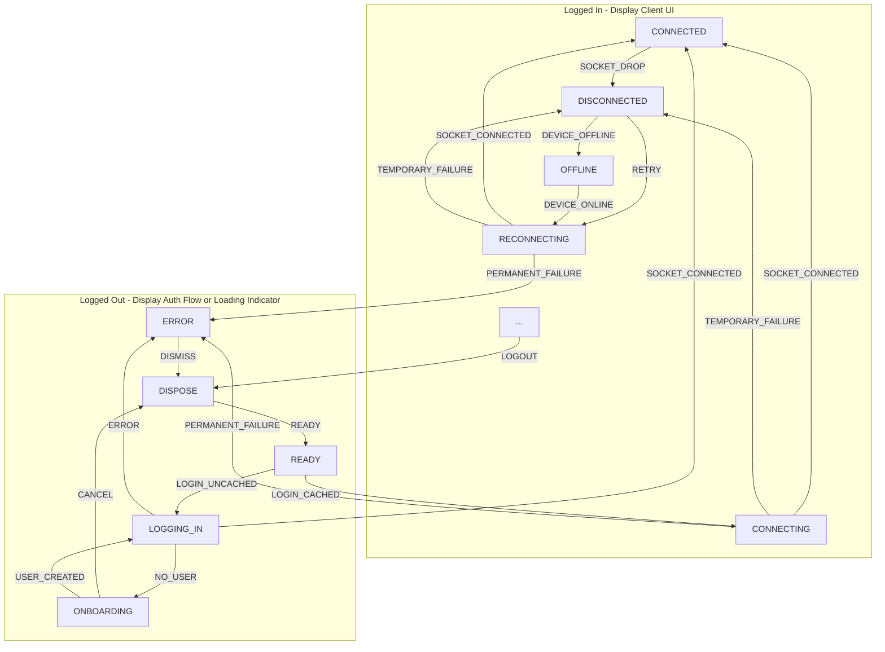

# Session Lifecycle

To ensure reliability for users on Revolt, clients should implement the following rigid specification for maintaing a session. At a high-level, it should be implemented as a state machine.

## Implementation Details

The table below describes how each node should behave.

- All nodes SHOULD have corresponding visual feedback.
- Nodes MAY have effects on entry.
- Nodes MAY register listeners for their lifetime.
- Transitions MAY NOT have side-effects.

|     Node     | User Interface                                                                                                                                                                                                                                                                                                                                                     | Logic                                                                                                                                                                             |
| :----------: | :----------------------------------------------------------------------------------------------------------------------------------------------------------------------------------------------------------------------------------------------------------------------------------------------------------------------------------------------------------------- | :-------------------------------------------------------------------------------------------------------------------------------------------------------------------------------- |
|    READY     | Show login interface                                                                                                                                                                                                                                                                                                                                               | _May transition out by external source._                                                                                                                                          |
|  LOGGING_IN  | Show loading indicator                                                                                                                                                                                                                                                                                                                                             | On entry, try to authenticate the user.                                                                                                                                           |
|  ONBOARDING  | Show username selection                                                                                                                                                                                                                                                                                                                                            | _May transition out by external source._                                                                                                                                          |
|    ERROR     | Show the permanent error     If an authentication error occurred, relay this back to the login interface.     If the error is BlockedByShield, provide a link to [the support article](https://support.revolt.chat/kb/safety/blocked-for-spam).     If userId is known, fetch user flags to determine if user is disabled, suspended, or banned. | _May transition out by external source._                                                                                                                                          |
|   DISPOSE    | Show loading indicator                                                                                                                                                                                                                                                                                                                                             | Dispose current client and create a new one.                                                                                                                                      |
|  CONNECTING  | Show client UI with banner "Connecting"                                                                                                                                                                                                                                                                                                                            | On entry, try to connect socket.                                                                                                                                                  |
|  CONNECTED   | Show client UI                                                                                                                                                                                                                                                                                                                                                     | _May transition out by external source._                                                                                                                                          |
| DISCONNECTED | Show client UI with banner "Disconnected"                                                                                                                                                                                                                                                                                                                          | _May transition out by external source._     If the device is offline, trigger transition to OFFLINE.     On entry, set a timer to retry.   On exit, cancel timer. |
| RECONNECTING | Show client UI with banner "Reconnecting"                                                                                                                                                                                                                                                                                                                          | On entry, invalidate cached data (message history, members list) and try to connect socket.                                                                                       |
|   OFFLINE    | Show client UI with banner "Device offline"                                                                                                                                                                                                                                                                                                                        | _May transition out by external source._                                                                                                                                          |

The following listeners need to be registered that emit the given transitions:

| Listener                                      | Transition          |
| --------------------------------------------- | ------------------- |
| Connected to Revolt (and initial data loaded) | `SOCKET_CONNECTED`  |
| Connection to Revolt dropped                  | `SOCKET_DROPPED`    |
| Received logout event from socket             | `LOGOUT`            |
| Connection failed                             | `TEMPORARY_FAILURE` |
| Connection failed (session invalid)           | `PERMANENT_FAILURE` |
| Device has gone online                        | `DEVICE_ONLINE`     |

<!--
TODO:

- Detect large no. of reconnects
- Detect outages -->
