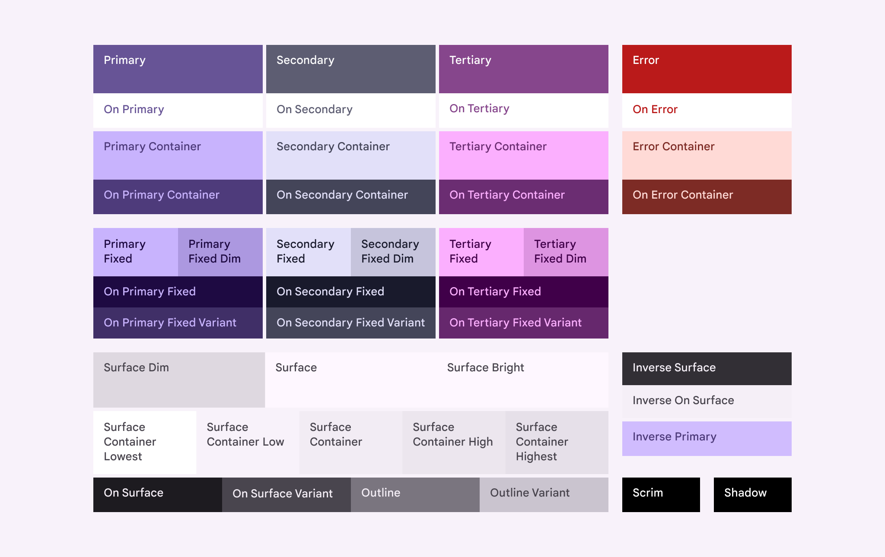

# Reference Guide

WIP: currently undergoing some work on this...

## Colour

The following Material colour roles are accessible through the CSS variables `var(--md-sys-color-*)`:

TODO: extension with online,idle,focus,busy,invisible

## Roundness

Border radius values are provided as `var(--borderRadius-none|xs|sm|md|lg|li|xl|xli|xxl|full|circle)`, these correspond to the corner radius scale in Material 3 expressive design.

Learn more here about how to apply the scale: https://m3.material.io/styles/shape/corner-radius-scale

## Gaps

Gap values are provided as `var(--gap-none|xxs|xs|s|sm|md|lg|x|xl|xxl)`

## Fonts

Font values are provided by:

- Primary: `var(--fonts-primary)`
- Monospace: `var(--fonts-monospace)`

## Typography

Typography tokens are currently fixed.

## Transitions

Two transition speeds are specified (in format, `<time> <easing>`):

- Fast: `var(--transitions-fast)`
- Medium: `var(--transitions-medium)`
