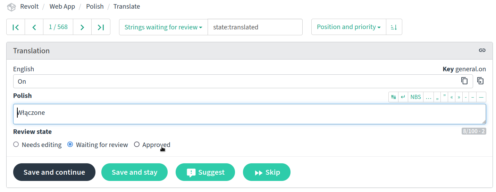

# Revolt Translations

This repository contains Revolt's translation files. Feel free to help translate Revolt to new languages or fix/improve existing translations on [our Weblate instance](https://weblate.insrt.uk/projects/revolt/web-app/). 

**Please do not submit fixes or new translations via pull requests.** Only open a pull request if you are adding new strings to the source language (en_GB) or if you're modifiying the scripts contained in this repository.

## Languages

The following table shows a list of languages, their contributors and maintainers (people enlisted to verify that the language's translations are up to standard).

Please note that this table **only includes languages that are currently available in the app**. If a language has been translated via Weblate and you want it to be added to the app, [please click here](https://github.com/revoltchat/frontend/issues/135).

{{TABLE}}

If you would like to maintain a language, please [open an issue](https://github.com/revoltchat/translations/issues/new/choose) with your request.

### What do I do? 

#### As a language maintainer

As a maintainer, you gain access to the Reviewer role on Weblate. This lets you approve new strings, edit approved strings and accept new suggestions. You may also be mentioned in GitHub issues to approve badges for others.

If you would like to be removed as a maintainer, please create an issue. (You will remain on the contributions list.)

#### As a repository maintainer

There are two different things that need to be handled:

- Languages proposed in [this issue](https://github.com/revoltchat/revite/issues/362) should be added to [Languages.ts](https://github.com/revoltchat/translations/blob/master/Languages.ts).
- Handle issues on this repository:
  - Badge requests: ensure that the language has a maintainer, ping any relevant maintainers to verify translations if you cannot yourself, afterwards the user can be added to the [list here](https://github.com/revoltchat/translations/blob/master/contributors.json)
  - Maintainership requests: ensure the user has sufficient contributions, then add them to the [list here](https://github.com/revoltchat/translations/blob/master/contributors.json)

## Coverage

